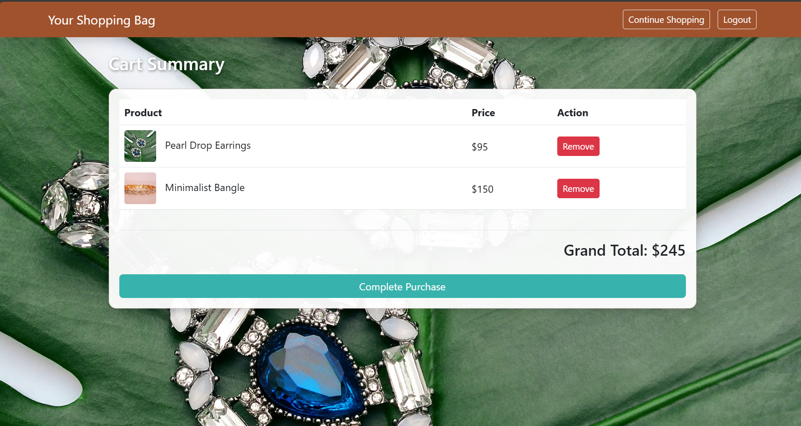

Dynamic Online Shopping Website

Project Overview

This is a fully functional, responsive web application for an online shopping site. It runs entirely in the browser using HTML, CSS, JavaScript, and LocalStorage (simulating a database). The project includes user authentication, an admin panel for product management, and a shopping cart system.

Features & Technologies Used

1. Technologies

HTML5 & CSS3: Structure and styling.

Bootstrap 5: Responsive layout (Grid system, Navbar, Forms).

Material Design: Used Google Material Icons and Bootstrap classes to implement Material Design principles (Cards, Buttons, Shadows).

JavaScript (ES6): Handles all logic, form validation, and DOM manipulation.

LocalStorage: Used for data persistence (Users, Products, Cart).

2. Bootstrap & Material Design Elements

Material Cards: Products are displayed in cards with shadow effects (shadow, card).

Material Inputs: Login and Registration forms use styled inputs (form-control).

Material Buttons: Primary and Warning buttons for actions (btn-primary, btn-warning).

Navbar: A responsive Bootstrap navbar that adapts based on the user (Admin vs. Regular User).

Icons: Google Material Icons used for the shopping bag, add button, etc.

Page Explanations & Workflow

1. Registration Page (register.html)

Purpose: Allows new users to create an account.

Workflow:

User enters Name, Email, Password, and Confirm Password.

Validation: JavaScript checks if passwords match and if the email is already taken.

CRUD Operation: CREATE (Adds a new user object to the users array in LocalStorage).

On success, redirects to the Login page.

2. Login Page (login.html)

Purpose: Authenticates users before accessing the shop.

Workflow:

User enters credentials.

Validation: Checks against the users array in LocalStorage.

Admin Check: Specific check for admin@gmail.com / admin123.

Session: Saves the logged-in user's email to localStorage key loggedInUser.

3. Home Page / Shop (index.html)

Purpose: The main landing page displaying products.

Workflow:

Checks if the user is logged in (redirects to Login if not).

Read Operation: Fetches the products list from LocalStorage and dynamically renders HTML cards.

Admin Feature: If the logged-in user is the Admin, an "Add Product" button appears.

4. Admin Page (admin.html)

Purpose: Allows the Admin to add new items to the store.

Workflow:

Admin fills in Product Name, Price, Image URL, and Description.

CRUD Operation: CREATE (Pushes a new product object to the products array).

Redirects to the Home Page to view the new item.

5. Shopping Cart (cart.html)

Purpose: Displays selected items and calculates the total price.

Workflow:

Read Operation: Fetches the cart array from LocalStorage.

Delete Operation: Users can remove items from the cart (updates LocalStorage).

Checkout: Clears the cart and simulates a purchase.

Project Screenshots

Home Page (Shop)

Shopping Cart

How to Run the Project

Download the project folder.

Open register.html in your browser.

Create an account (or use the Admin credentials below).

Login and start using the application.

Admin Credentials

To access Admin features (Add Product):

Email: admin@gmail.com

Password: admin123